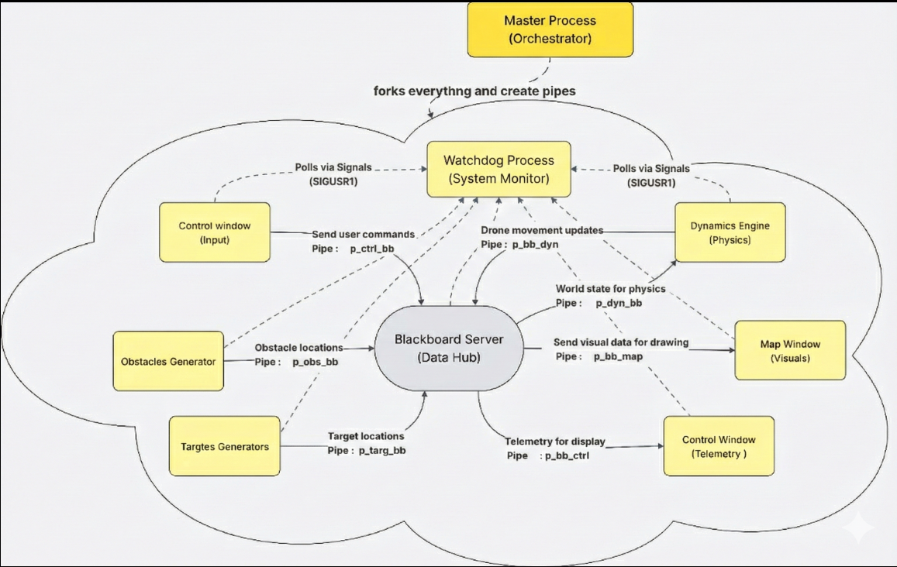
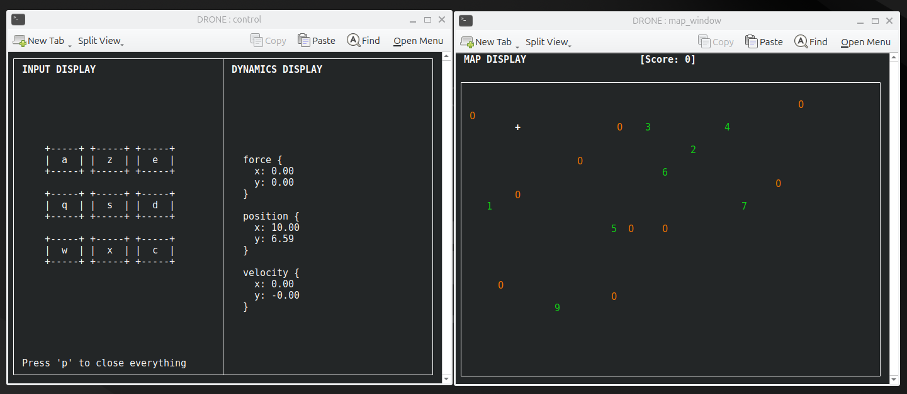
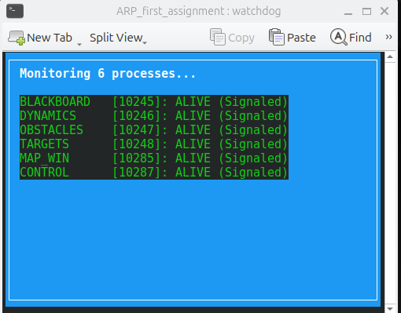

# Drone Simulator Project - Assignment 1+2+3
**Author:** Bouhraoua Hani  
**Student:** 8314923   

**Tested with Riadh Bahri** , ID :8335614   

**Date of testing assignment 3:** January 13, 2026  


# Project Overview

The Drone Simulator is a real-time, multi-process system that models drone navigation within a 2D environment populated with targets and obstacles. The system utilizes a Blackboard Architecture, enabling independent processes to collaborate by reading and writing shared information to a central Blackboard Server. A key feature is its Network Capability, which allows the simulation to run across two different laptops regardless of the user group; one user acts as the Server while the other connects as the Client, or vice versa. Additionally, the architecture integrates a Watchdog process for system health monitoring and fault detection, alongside a dedicated Logger process that manages concurrent writing to shared log files (system.log, watchdog.log) to ensure data integrity without corruption.

## System Architecture
This diagram illustrates the process hierarchy and IPC data flow. The Master acts as the bootstrapper.



## Simulation Demo
Below is a snapshot of the simulation in action, showing the visual output rendered by the Control Window based on data fetched from Shared Memory plus the monitoring system called watchdog.




## 1. Sketch of the Architecture
The system implements a concurrent, multi-process **Blackboard Architecture**.
The `Blackboard` process acts as the central repository. All other processes communicate only with the Blackboard using **unnamed pipes**, ensuring modularity and decoupling. A separate **Watchdog** process monitors the system health.

**Data Flow:**
1. **Input:** `Control Window` captures keystrokes                → sends force data to the Blackboard.
2. **Environment:** `Obstacles` & `Targets` generate coordinates → send to the Blackboard.
3. **Physics:** `Dynamics` reads state from the Blackboard       → computes new state → updates Blackboard.
4. **Output:** `Map Window` reads Blackboard state               → renders the simulation.
5. **Monitoring:** `Watchdog` polls all processes                → logs status and alerts on failures.


---

## 2. Active Components Definition

### A. Master (`master.c`)
* **Role:** System orchestrator.
* **Function:** Creates 7 pipes, forks all processes (including Watchdog), manages PIDs via `pids.txt`, and ensures safe termination.
* **Primitives:** `pipe()`, `fork()`, `exec()`, `kill()`, `waitpid()`.

### B. Blackboard Server (`blackboard.c`)
* **Role:** Central Hub.
* **Function:** Routes data between agents using non-blocking multiplexing.
* **Primitives:** `select()`, `read()`, `write()` , `socket()`, `accept()`.
* **Logic:** FD-set scanning + event-driven routing + TCP Protocol synchronization.

### C. Drone Dynamics (`dynamics.c`)
* **Role:** Physics engine.
* **Function:** Maintains drone state (position, velocity, forces) and reports specific status (e.g., "Calculating Physics") to the Watchdog.
* **Algorithms:**
  1. **Motion Integration:** Euler method.
  2. **Repulsion Model:** Latombe/Khatib potential fields.
  3. **Virtual Key Mapping:** Projects repulsion to directional commands.


### D. Map Window (`map_window.c`)
* **Role:** Renderer.
* **Function:** Draws drone, targets, obstacles. Handles terminal resizing.
* **Primitives:** `ncurses` (colors, windows).

### E. Control Window (`control.c`)
* **Role:** Input handler.
* **Function:** Reads raw keyboard inputs and maps them to force vectors.
* **Primitives:** `ncurses` (non-blocking).

### F. Targets & Obstacles (`targets.c`, `obstacles.c`)
* **Role:** Random environment generators.
* **Function:** Periodically generate coordinate updates and sleep for 60 seconds (interruption-safe).
* **Logic:** Random generation with minimum-distance constraints.

### G. Watchdog (`watchdog.c`)
* **Role:** System Monitor.
* **Function:** Polls all active processes periodically using signals (`SIGUSR1`).
* **Logic:**
  * Reads polling interval (`WatchdogT`) from `params.txt`.
  * Verifies process responsiveness via PID checks.
  * Writes status logs to `watchdog.log`.
  * Displays a real-time status window (Green=Alive, Red=Unresponsive).

### H. logger  (logger.c)
* **Role:** Safe I/O Utility.
* **Function:** Manages concurrent writing to shared log files  (`system.log`, `watchdog.log`) without data corruption.
* **Logic:**

   * Uses file locking (`lockf`) to enforce mutual exclusion when multiple processes write simultaneously.
   * Appends a standard timestamp (Day Month Time Year) to every entry.
   * Forces immediate disk writes (`fflush`) to prevent data loss during crashes.
---

## 3. Digital Solution of the Dynamic Equation

The motion of the drone is governed by Newton's Second Law with viscous friction. To simulate this digitally, we solve the dynamic equation numerically.

The vector equation is split into two scalar equations for the **X** and **Y** components.
Considering the **X** component as an example:

$$(2) \quad \sum F_x = M \frac{d^2x}{dt^2} + K \frac{dx}{dt}$$

To solve this in real-time, we apply **Euler's Method** for discretization. By approximating the derivatives with finite differences over the integration interval $T$, the equation becomes:

$$(3) \quad \sum F_{x,i} = M \left( \frac{x_i - 2x_{i-1} + x_{i-2}}{T^2} \right) + K \left( \frac{x_i - x_{i-1}}{T} \right)$$

**Where:**
* T: Integration interval (Sampling time).
* x_i: Current position.
* x_{i-1}, x_{i-2}: Previous positions.
* **Suggested Values for T:** $10 \div 100 \text{ ms}$ (corresponding to a $100 \div 10 \text{ Hz}$ simulation cycle).


## 4. Directories
```
text
/DRONE_ROOT/
│
├── Makefile                  # Build script
├── run.sh                    # Execution script
├── README.md                 # Project documentation
├── params.txt                # System Parameters (Physics + Watchdog)
├── pids.txt                  # Process ID Registry     (Created at runtime)
├── system.log                # Master/System error log (Created at runtime)
├── watchdog.log              # Watchdog activity log   (Created at runtime)
│
├── assets/                   # Assets Directory
│   ├── Project_simulation.png
│   ├── Watchdog.png
│   └── Project_Architecture.png
│
│
└── src_code/                 # Source Code Directory
    ├── master.c              # Main process
    ├── blackboard.c          # Server
    ├── dynamics.c            # Physics logic
    ├── map_window.c          # Visualization
    ├── control.c             # Input handling
    ├── obstacles.c           # Generator
    ├── targets.c             # Generator
    ├── watchdog.c            # System Monitor
    ├── logger.c              # Shared logging utility
    ├── logger.h              # Logger header
    ├── drone.h               # Shared header (Structs, Signals & Includes)
    └── params.txt            # System Parameters (Physics + Watchdog)
```

## 5. Operational Instructions

### Controls
```text
a / z / e : Up-Left    / Up     / Up-Right  
q / S / D : Left       / BRAKE  / Right  
w / x / c : Down-Left  / Down   / Down-Right  

P         : Quit Simulation
```

### Visual Legend
+   → Drone (white)  
1–9 → Targets (green, collected in order)  
O   → Obstacles (yellow, repulsive)

### Real-Time Parameters (Editable at Runtime)

Configuration file:

configuration/params.txt

Parameters:  
- M — Drone mass  
- K — Viscous friction  
- T — Time-step  

These can be edited while the system is running.

---

## 6. Installation and Running

### Prerequisites
Install ncurses:  
```text
sudo apt-get install libncurses5-dev libncursesw5-dev
```
Also make sure to install Konsole (used to display the two windows correctly on KDE-based systems):
```text
sudo apt-get install konsole
```

### Compilation
From project root:  
```text
make
```

This compiles all files inside src_code/.

### Execution

Using script:  
```text
chmod +x run.sh 
./run.sh
```

Or manual:  
```text

./master
```

### Running Modes.

When Executing the program, you will be asked to choose a mode:

* **Mode 1 (Single Player)**: Runs the simulation locally.
* **Mode 2 (Server)**: Acts as the host. The program will wait for a client to connect.
* **Mode 3 (Client)**: Connects to a running Server. You must provide the Server's IP address (found by running `ip addr` on the Server's machine).


Stop simulation using **P** in the Control Window or by closing the terminal.

