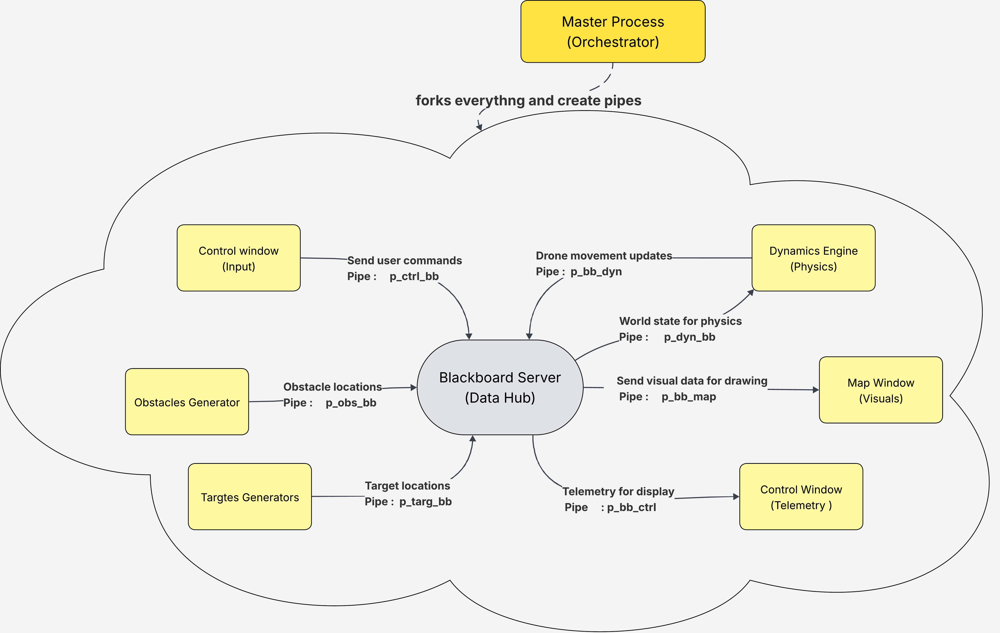
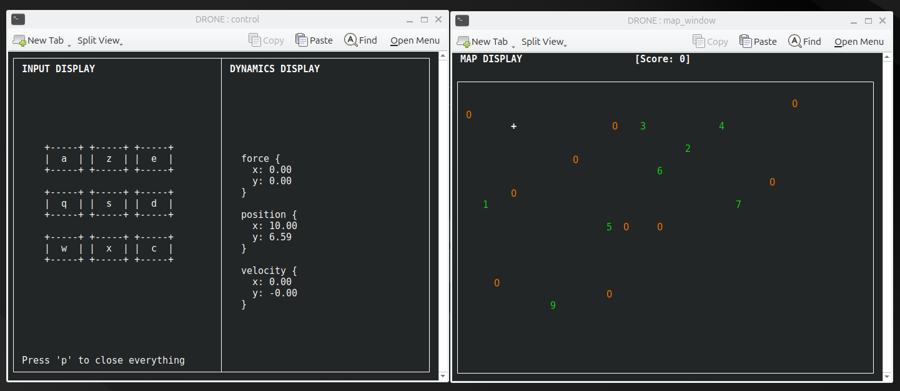

# Drone Simulator Project - Assignment 1
**Author:** Bouhraoua Hani  
**Student:** 8314923  
**Date:** December 4, 2024

# Project Overview

The Drone Simulator is a multi-process real-time system that models the behavior of a drone navigating inside a 2D environment populated with targets and obstacles. The system follows a Blackboard Architecture, a design where multiple processes collaborate by reading and writing shared information to a central data structure called the Blackboard Server.

## System Architecture
This diagram illustrates the process hierarchy and IPC data flow. The Master acts as the bootstrapper.



## Simulation Demo
Below is a snapshot of the simulation in action, showing the visual output rendered by the Control Window based on data fetched from Shared Memory.



## 1. Sketch of the Architecture
The system implements a concurrent, multi-process **Blackboard Architecture**.  
The `Blackboard` process acts as the central repository. All other processes communicate only with the Blackboard using **unnamed pipes**, ensuring modularity and decoupling.


**Data Flow:**
1. **Input:** `Control Window` captures keystrokes               → sends force data to the Blackboard.  
2. **Environment:** `Obstacles` & `Targets` generate coordinates → send to the Blackboard.  
3. **Physics:** `Dynamics` reads state from the Blackboard       → computes new state → updates Blackboard.  
4. **Output:** `Map Window` reads Blackboard state               → renders the simulation.


---

## 2. Active Components Definition

### A. Master (`master.c`)
* **Role:** System orchestrator.  
* **Function:** Creates 7 pipes, forks all processes, manages PIDs, and ensures safe termination.  
* **Primitives:** `pipe()`, `fork()`, `exec()`, `kill()`, `waitpid()`.

### B. Blackboard Server (`blackboard.c`)
* **Role:** Central Hub.  
* **Function:** Routes data between agents using non-blocking multiplexing.  
* **Primitives:** `select()`, `read()`, `write()`.  
* **Logic:** FD-set scanning + event-driven routing.

### C. Drone Dynamics (`dynamics.c`)
* **Role:** Physics engine.  
* **Function:** Maintains drone state: position, velocity, forces.  
* **Algorithms:**  
  1. **Motion Integration:** Euler method.  
  2. **Repulsion Model:** Latombe/Khatib potential fields.  
  3. **Virtual Key Mapping:** Projects repulsion to directional commands.

### D. Map Window (`map_window.c`)
* **Role:** Renderer.  
* **Function:** Draws drone, targets, obstacles. Handles terminal resizing.  
* **Primitives:** `ncurses` (colors, windows).

### E. Control Window (`control.c`)
* **Role:** Input handler.  
* **Function:** Reads raw keyboard inputs and maps them to force vectors.  
* **Primitives:** `ncurses` (non-blocking).

### F. Targets & Obstacles (`targets.c`, `obstacles.c`)
* **Role:** Random environment generators.  
* **Function:** Periodically send coordinate updates.  
* **Logic:** Random generation with minimum-distance constraints.

---

## 3. Directory Structure & Files

```text
/DRONE_ROOT/
│
├── Makefile                  # Build script
├── run.sh                    # Execution script
├── README.md                 # Project documentation 
├── params.txt
│
├── assets/                   # assets Directory 
│   ├── Project_simulation.png            
│   └── Project_Architecture.png 
│   
│
└── src_code/                 # Source Code Directory
    ├── master.c              # Main process
    ├── blackboard.c          # Server
    ├── dynamics.c            # Physics logic
    ├── map_window.c          # Visualization
    ├── control.c             # Input handling
    ├── obstacles.c           # Generator
    ├── targets.c             # Generator
    ├── drone.h               # Shared header (Structs & Includes)
    └── params.txt
``` 
    
## 4. Operational Instructions

### Controls
```text
a / z / e : Up-Left    / Up     / Up-Right  
q / S / D : Left       / BRAKE  / Right  
w / x / c : Down-Left  / Down   / Down-Right  

P         : Quit Simulation
```

### Visual Legend
+   → Drone (white)  
1–9 → Targets (green, collected in order)  
O   → Obstacles (yellow, repulsive)

### Real-Time Parameters (Editable at Runtime)

Configuration file:

configuration/params.txt

Parameters:  
- M — Drone mass  
- K — Viscous friction  
- T — Time-step  

These can be edited while the system is running.

---

## 5. Installation and Running

### Prerequisites
Install ncurses:  
```text
sudo apt-get install libncurses5-dev libncursesw5-dev
```
Also make sure to install Konsole (used to display the two windows correctly on KDE-based systems):
```text
sudo apt-get install konsole
```

### Compilation
From project root:  
```text
make
```

This compiles all files inside src_code/.

### Execution

Using script:  
```text
chmod +x run.sh 
./run.sh
```

Or manual:  
```text

./master
```

Stop simulation using **P** in the Control Window or by closing the terminal.

